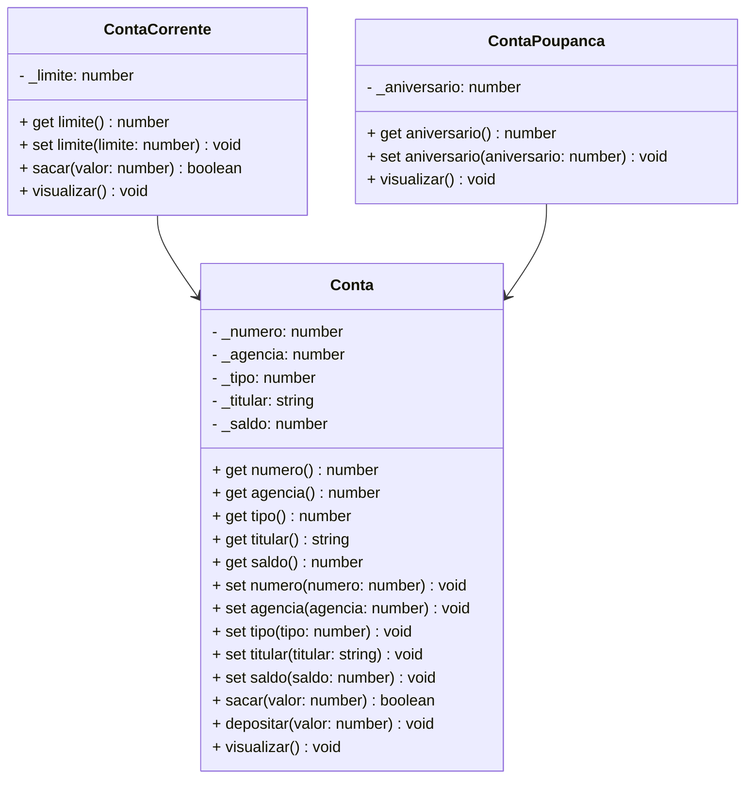

# Projeto Conta Bancária - TypeScript & POO

## Simulador Educacional de Sistema Bancário | Portfólio Profissional

<br />

<div align="center">
    
</div>

<br />

<div align="center">
    
    
    
    
</div>

---

## Sobre o Projeto

O **Projeto Conta Bancária** é uma aplicação desenvolvida em **TypeScript** com foco na consolidação de **Programação Orientada a Objetos (POO)** e arquitetura de software.

Diferente de exercícios isolados de lógica, este projeto simula uma estrutura real dividida em responsabilidades, onde o foco é a escalabilidade, manutenção de código e implementação de regras de negócio financeiras, como **CRUD de contas, transferências, depósitos e saques**.

## Funcionalidades e Regras de Negócio

A aplicação gerencia o ciclo de vida de contas bancárias através de um menu interativo no console (CLI).

| Funcionalidade | Status | Descrição |
| :--- | :---: | :--- |
| **CRUD de Contas** | ✅ | Criação, leitura, atualização e exclusão de contas em memória. |
| **Tipos de Conta** | ✅ | Suporte a Conta Corrente (com limite) e Conta Poupança (com aniversário). |
| **Transações** | ✅ | Depósitos, saques e transferências entre contas com validação de saldo. |
| **Consultas** | ✅ | Busca de contas por número ou titular. |
| **Validações** | ✅ | Tratamento de erros e exceções para impedir operações inválidas. |

## Arquitetura e Conceitos Técnicos (POO)

O desenvolvimento foi estruturado para demonstrar competência técnica na aplicação dos pilares da Orientação a Objetos. Abaixo, a correlação entre as regras de negócio e a solução técnica:

| Componente Bancário | Regra de Negócio | Conceito Técnico Aplicado |
| :--- | :--- | :--- |
| **Conta (Base)** | Define o modelo padrão. Não é possível instanciar uma conta genérica, apenas tipos específicos. | **Classe Abstrata** e Encapsulamento (`protected`). |
| **Conta Corrente** | Possui atributos exclusivos (limite) e regra de saque específica (saldo + limite). | **Herança** (`extends`) e **Polimorfismo** (Sobrescrita de métodos). |
| **Repositório** | Define o contrato obrigatório que o controlador deve seguir para gerenciar os dados. | **Interface** (`interface`) e Abstração. |
| **Controller** | Gerencia a lista de contas e processa as operações solicitadas. | Implementação de Interface e Manipulação de Coleções. |
| **Menu** | Interface de usuário para entrada e saída de dados. | Tratamento de Exceções (`try/catch`). |

## Diagrama de Classes

A estrutura das classes segue o padrão UML abaixo, evidenciando a herança e o encapsulamento:



## Estrutura do Projeto
A organização de pastas segue uma arquitetura em camadas para facilitar a manutenção e leitura técnica:
```plaintext
 ┣ 📂 src
 ┃ ┣ 📂 controller      # Regras de aplicação e gerenciamento de estados
 ┃ ┣ 📂 model           # Entidades de domínio (Conta, ContaCorrente, etc.)
 ┃ ┣ 📂 repository      # Interfaces (Contratos do sistema)
 ┃ ┗ 📂 util            # Cores para o terminal e helpers
 ┣ 📜 Menu.ts           # Ponto de entrada (Main)
 ┗ 📜 tsconfig.json     # Configuração do compilador
```

 ## Impacto Técnico e Métricas

| Indicador | Detalhe |
| :--- | :--- |
| **Linhas de código** | +600 |
| **Conceitos POO** | Herança, Polimorfismo, Encapsulamento, Abstração |
| **Camadas** | Model, Repository, Controller, View (Console) |
| **Persistência** | Simulada em memória (ArrayList/Collection) |

<div align="center">Desenvolvido para fins de estudo e portfólio.</div>
